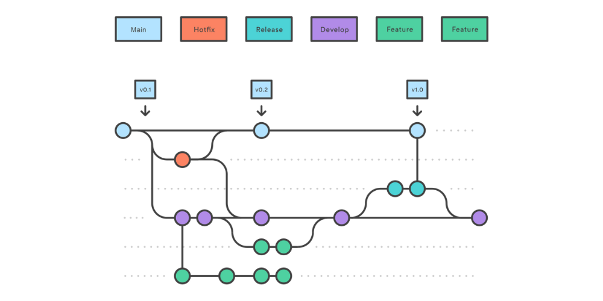

# **Git Flow** - это стратегия ветвления, которая используется на проекте. 

+ **main** - это стабильный готовый к работе код (развернута производественная среда, разрешены только MR c веток **release** и **hotfix**).
+ **develop** - это место, где происходит вся разработка (развернут тестовая среда, по умолчанию, разрешены только MR c веток **feature** и **hotfix**, изначально создается из **main**).
+ **feature** -  используются для разработки новых функций или изменений (не разрешены MR, создается из **develop**). 
+ **release** - используются для подготовки к новому выпуску (не разрешены MR, создается из **develop**). 
+ **hotfix** - используются для быстрого решения критических проблем в производственном коде (не разрешены MR, создается из **main**).

# Рабочий процесс Git Flow

1. В самом начале создайте ветку **develop**: эта ветка будет использоваться для текущей разработки. Ветка **develop** создается из **main** ветки.

2. Создание веток **feature**: при начале работы над новой функцией или исправлением ошибки создайте новую ветку **feature** из ветки **develop**.

3. Разработайте и объедините ветку **feature** с **develop**: внесите необходимые изменения в свой локальный код в ветке **feature**. Как только функция будет завершена и протестирована, объедините ветку обратно в ветку **develop**.

4. Создайте ветку **release**: Когда пришло время подготовить новый релиз, создайте новую ветку **release** из ветки **develop** с именем, включающим номер версии, например, **release/1.0**. Тщательно протестируйте выпуск, чтобы выявить любые ошибки или проблемы, чтобы убедиться, что он готов к работе.

5. Объедините ветку **release** с **main**: когда релиз будет готов, объедините ветку **release** с **main** веткой и пометьте ее номером версии. Используйте MR, чтобы обеспечить проверку кода и одобрение другими членами команды.

6. Повторите процесс: после завершения выпуска вернитесь к ветке **develop** и снова начните процесс с новой веткой **feature**.

Если обнаружена критическая проблема в **main** ветке:

1. Создайте ветвь **hotfix** из **main**: эта ветвь используется для быстрого исправления критических проблем или ошибок в производственном коде, которые не могут дождаться следующего цикла выпуска.

2. Слияние ветки **hotfix** с ветвями **develop** и **main**: после того, как исправление завершено и протестировано, оно объединяется как с ветвью **develop**, так и с **main** ветвью, чтобы гарантировать, что исправление применяется как к текущей разработке, так и к рабочему коду.

